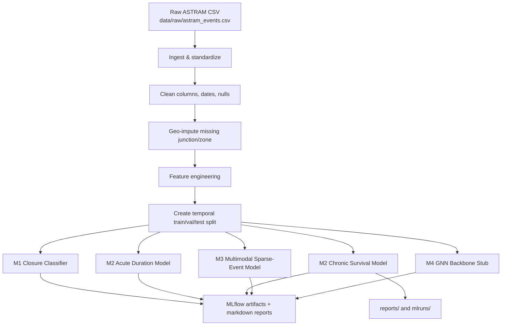

# ASTRA ML Pipeline

Adaptive System for Traffic Response & Analytics.

This repository contains the full machine learning pipeline used to clean the raw
ASTRAM event log, engineer temporal and geo features, train multiple models, and
generate evaluation reports for Bengaluru traffic-event prediction.

## What This Project Does

The pipeline takes raw event records and turns them into trained models for four
tasks:

1. **M1**: classify whether an event requires road closure.
2. **M2**: estimate duration with separate acute and chronic regimes.
3. **M3**: handle sparse or novel event types with a multimodal model.
4. **M4**: validate a graph spatio-temporal backbone on synthetic data.

The code is organized as a reproducible batch pipeline rather than an API or UI.

## End-to-End Flow



## Pipeline Stages

### 1. Data ingestion

The raw source is [data/raw/astram_events.csv](data/raw/astram_events.csv). The
ingestion step normalizes column names, parses datetimes, and writes typed data to
intermediate storage.

### 2. Cleaning

The cleaning step standardizes missing values, resolves duration sources, and
prepares consistent event records for downstream modeling.

### 3. Geo-imputation

Missing `junction` and `zone` values are recovered using location-based logic.
The current data quality report shows that geo-imputation reduced null rates to
0.0% for both fields.

### 4. Feature engineering

This stage creates temporal, text-length, target-encoded, and imputation-flag
features that power the classification and regression models.

### 5. Temporal split

The final dataset is split by time, not randomly:

- Train: before 2024-02-15
- Validation: 2024-02-15 to 2024-03-15
- Test: after 2024-03-15

This matters because the data is chronological and has seasonality and drift.

## Model Overview

### M1 - Closure Necessity Classifier

- Baseline: RandomForest (ROC-AUC 0.8004, PR-AUC 0.3175)
- Challengers: CatBoost and LightGBM
- Primary optimization metric: **F2-score** (weights recall 2x precision) under a **hard Recall floor of $\ge 0.85$** on the test split.
- **Multilingual text embeddings**: Integrates 384-dimensional `"sentence-transformers/paraphrase-multilingual-MiniLM-L12-v2"` mean-pooled embeddings for Kannada/English descriptions as tabular features.
- **Probability Calibration**: Calibrates LightGBM probabilities on validation using **Isotonic Regression**.
- **Bootstrap Resampling**: Fits thresholds per cause group (high, medium, low, very low closure clusters) using 200 bootstrap iterations to guarantee the recall floor locally, routing the random-signal `pot_holes` cause to a global fallback.
- **macOS Multiprocessing**: Built with `n_jobs=1` inside LightGBM to prevent macOS semaphore leaks and segfaults.

### M2 - Duration Estimator

- Acute regime: CatBoost and LightGBM regressors on short-duration events
- Chronic regime: survival models for long-running or censored events
- Primary metrics: log-MAE for acute, C-index for chronic

### M3 - Sparse / Novel Event Forecaster

- Uses **precomputed** `"google/muril-base-cased"` text embeddings plus structured features.
  * **Memory Optimization**: Employs a memory-efficient training strategy. Instead of fine-tuning the heavy transformer online (which triggers OOM/SIGKILL on RAM-constrained machines), the text embeddings are extracted *once* at start-up in a `torch.no_grad()` block. The transformer is then completely unloaded from RAM.
  * **Trainable Text Projection**: A lightweight trainable projection MLP acts as an adapter, aligning the precomputed embeddings during multi-task training (joint BCE closure + MSE log-duration loss).
- Evaluated with leave-one-cause-out cold-start validation simulating true zero-shot event scenarios.
- Primary metrics: ROC-AUC and PR-AUC per held-out cause.

### M4 - Graph Spatio-Temporal Backbone

- Architecture validation only, implementing a simplified Graph WaveNet with PyTorch.
- Trained on synthetic traffic metrics (speed, flow) over an OSM road graph to verify the spatio-temporal architecture compiles, trains, and converges.
- Not a production-quality traffic predictor yet (requires live speed data streams).

## Current Evaluation Results

### M1 - Closure classifier

| Model / Experiment | Recall | Precision | F2-score | F1-score | PR-AUC | Accuracy |
| :--- | :---: | :---: | :---: | :---: | :---: | :---: |
| **Baseline (Global Uncalibrated)** | 88.73% | 15.48% | 45.59% | 26.36% | 0.4448 | 57.05% |
| **Champion (Calibrated + Cause Thresholds)** | **88.03%** | **12.05%** | **38.94%** | **19.82%** | **0.3705** | **32.09%** |

*Note: Champion model utilizes the Variant B feature set (including multilingual embeddings), Isotonic calibration, and bootstrap-fitted thresholds.*

### M2 - Acute duration model

| Model | log-MAE | MAE | RMSE |
| --- | ---: | ---: | ---: |
| CatBoost (acute) | 0.7531 | 30.8080 | 41.0117 |

Pooled baseline log-MAE: 1.5775

### M2 - Chronic survival model

| Model | C-index | log-MAE (uncensored) |
| --- | ---: | ---: |
| GBST | 0.5208 | 1.0006 |

### M3 - Sparse-event multimodal model

| Held-out cause | ROC-AUC | PR-AUC |
| --- | ---: | ---: |
| vip_movement | 0.5625 | 0.8100 |
| protest | 0.4630 | 0.4199 |
| procession | 0.5392 | 0.3272 |
| public_event | 0.5761 | 0.5285 |

### M4 - Graph backbone stub

- Synthetic training loss: 1.012111
- Total parameters: 30,401
- This is a stub, not a real traffic benchmark

## Repository Layout

* [configs/](file:///Users/prathameshnawale/Desktop/Flipkart%20Grid%202.0/PS2/astra-ml/configs) — YAML configurations for dataset and model hyper-parameters.
* [data/](file:///Users/prathameshnawale/Desktop/Flipkart%20Grid%202.0/PS2/astra-ml/data) — Raw, interim (geo-imputed/cleaned), and processed split files.
* [reports/](file:///Users/prathameshnawale/Desktop/Flipkart%20Grid%202.0/PS2/astra-ml/reports) — Evaluation summaries and data quality analysis reports.
* [src/astra_ml/data/](file:///Users/prathameshnawale/Desktop/Flipkart%20Grid%202.0/PS2/astra-ml/src/astra_ml/data) — Data pipeline scripts:
  * [ingest.py](file:///Users/prathameshnawale/Desktop/Flipkart%20Grid%202.0/PS2/astra-ml/src/astra_ml/data/ingest.py) (ingestion and standard typing)
  * [clean.py](file:///Users/prathameshnawale/Desktop/Flipkart%20Grid%202.0/PS2/astra-ml/src/astra_ml/data/clean.py) (coalescing duration sources)
  * [geo_impute.py](file:///Users/prathameshnawale/Desktop/Flipkart%20Grid%202.0/PS2/astra-ml/src/astra_ml/data/geo_impute.py) (OSM graph & zone snaps)
  * [features.py](file:///Users/prathameshnawale/Desktop/Flipkart%20Grid%202.0/PS2/astra-ml/src/astra_ml/data/features.py) (cyclical times & target-encodings)
  * [splits.py](file:///Users/prathameshnawale/Desktop/Flipkart%20Grid%202.0/PS2/astra-ml/src/astra_ml/data/splits.py) (chronological splits)
* [src/astra_ml/models/](file:///Users/prathameshnawale/Desktop/Flipkart%20Grid%202.0/PS2/astra-ml/src/astra_ml/models) — Model implementations:
  * [m1_closure_classifier.py](file:///Users/prathameshnawale/Desktop/Flipkart%20Grid%202.0/PS2/astra-ml/src/astra_ml/models/m1_closure_classifier.py) (LightGBM/CatBoost classifiers)
  * [m2_duration_acute.py](file:///Users/prathameshnawale/Desktop/Flipkart%20Grid%202.0/PS2/astra-ml/src/astra_ml/models/m2_duration_acute.py) (Regressors for short events)
  * [m2_duration_chronic_survival.py](file:///Users/prathameshnawale/Desktop/Flipkart%20Grid%202.0/PS2/astra-ml/src/astra_ml/models/m2_duration_chronic_survival.py) (Survival trees for long events)
  * [m3_multimodal_fusion.py](file:///Users/prathameshnawale/Desktop/Flipkart%20Grid%202.0/PS2/astra-ml/src/astra_ml/models/m3_multimodal_fusion.py) (MuRIL text embeddings + structured MLP)
  * [m4_gnn_backbone.py](file:///Users/prathameshnawale/Desktop/Flipkart%20Grid%202.0/PS2/astra-ml/src/astra_ml/models/m4_gnn_backbone.py) (Graph WaveNet spatio-temporal validation stub)
* [tests/](file:///Users/prathameshnawale/Desktop/Flipkart%20Grid%202.0/PS2/astra-ml/tests) — pytest validation unit test suites.

## Setup

Install dependencies and create the virtual environment:

```bash
make setup
```

If you already have the environment active, you can skip this step.

## Run The Full Pipeline

Run the data preparation pipeline first:

```bash
make data
```

Then train the models:

```bash
make train-m1
make train-m2
make train-m3
make train-m4
```

Generate the final markdown reports:

```bash
make eval
```

Run the tests:

```bash
make test
```

## What Each Command Produces

- `make data` writes the featured and split parquet files to `data/processed/`.
- `make train-m1` trains the closure classifier and writes `reports/m1_closure_classifier.md`.
- `make train-m2` trains acute and chronic duration models and writes `reports/m2_duration_estimator.md` and `reports/m2_chronic_survival.md`.
- `make train-m3` trains the sparse-event multimodal model and writes `reports/m3_multimodal_sparse.md`.
- `make train-m4` runs the graph backbone architecture stub and writes `reports/m4_gnn_backbone.md`.
- `make eval` regenerates the report files in `reports/`.
- `make test` runs the pytest suite.

## Data Quality Notes

The generated [data quality report](reports/data_quality.md) documents how the
pipeline recovered missing values and resolved duration sources:

- `junction` null rate: 69.3% -> 0.0%
- `zone` null rate: 57.9% -> 0.0%
- duration source resolution uses `closed_datetime` and `resolved_datetime` coalescing

These corrections are important because they materially improve downstream model coverage.

## MLflow Outputs

All model runs are logged locally under `mlruns/` with separate experiment IDs for
each task. Each training target saves both the serialized model artifact and a
markdown report.

If you want to inspect the runs, start the MLflow UI from the project root:

```bash
mlflow ui --backend-store-uri mlruns --default-artifact-root mlruns
```

Then open:

```text
http://127.0.0.1:5000
```

## Troubleshooting

- If a training command fails, rerun it from the `astra-ml/` directory.
- Make sure the `data/processed/events_splits.parquet` file exists before training.
- If you change dependencies, rerun `make setup`.
- The M4 model is intentionally synthetic; it does not represent real traffic performance.

## Quick Start

```bash
cd astra-ml
make setup
make data
make train-m1
make train-m2
make train-m3
make train-m4
make eval
make test
```
