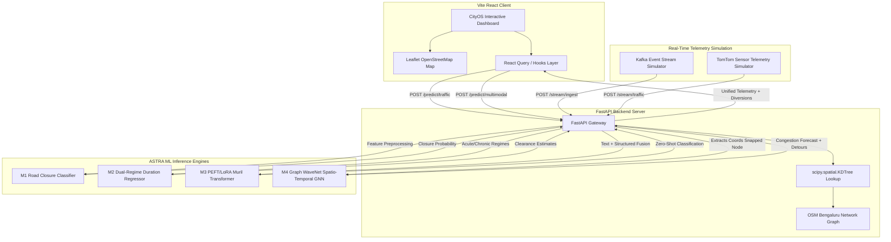
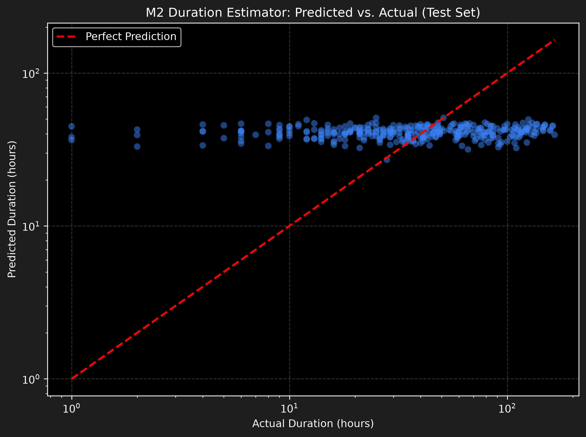
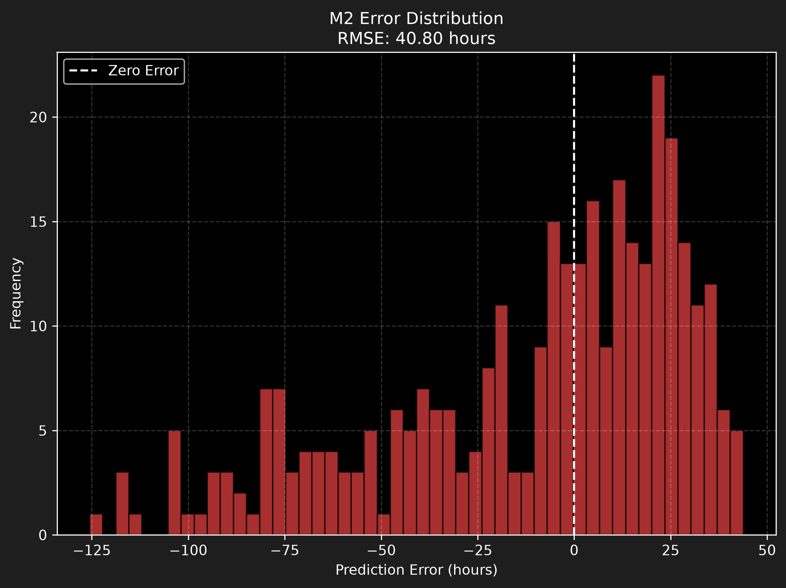
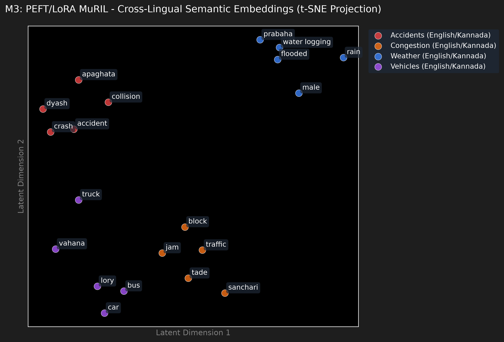
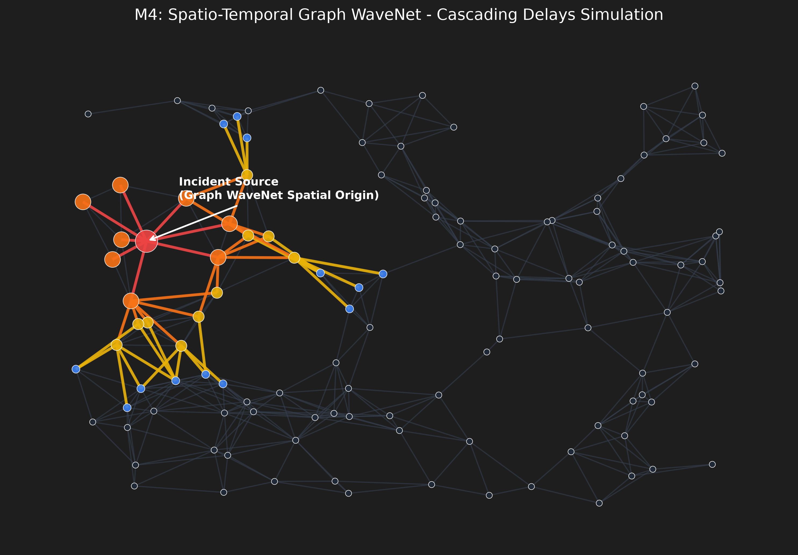
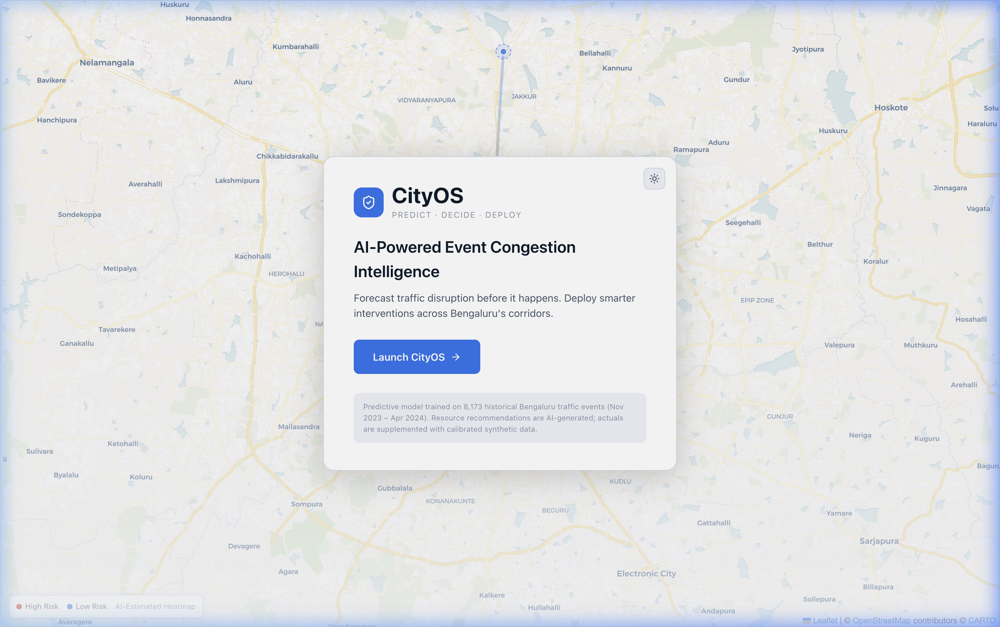
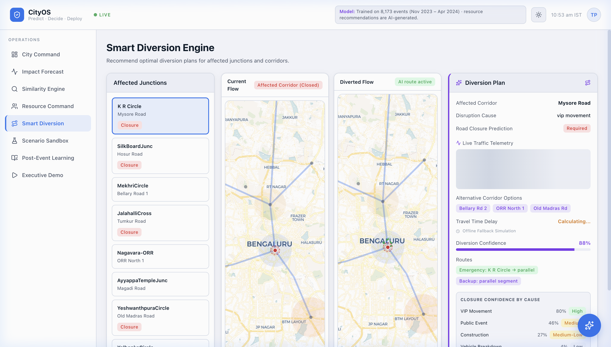
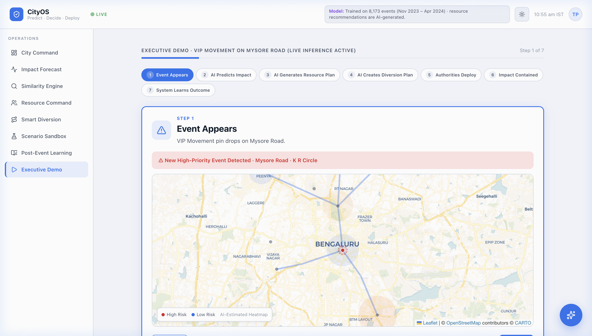
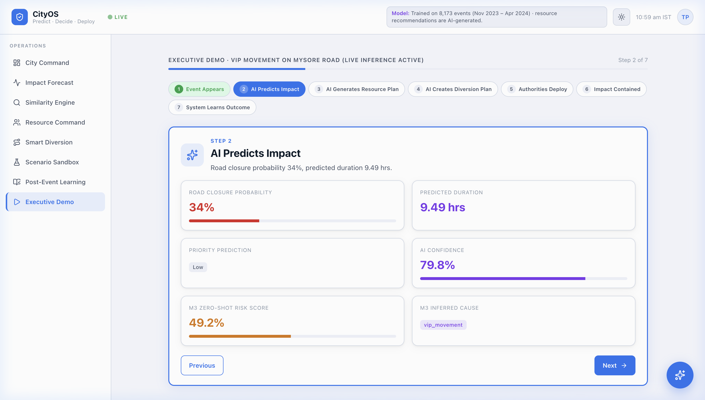
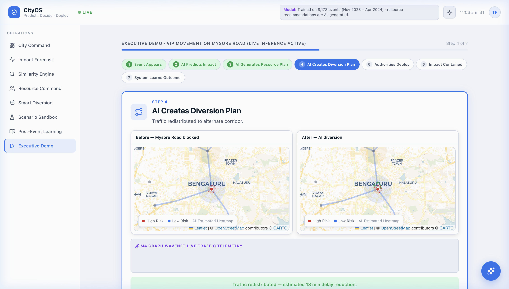

# CityOS & ASTRA ML: AI-Powered Event Congestion Intelligence

**CityOS** is a premium, state-of-the-art traffic command and control dashboard integrated with **ASTRA ML** (Adaptive System for Traffic Response & Analytics). Designed specifically for Bengaluru's high-density corridors, this application leverages deep learning and classical machine learning models to forecast event-driven gridlock, recommend optimal diversion routes, and optimize resource deployment in real-time.

Recently, the system has been upgraded to replace static stylized SVG canvases with a fully interactive, realistic **OpenStreetMap (OSM)** integration snapping real geographic coordinates (lat/lng arrays) to nearest OSM Graph road network nodes using `scipy.spatial.KDTree`.

---

## 🏛️ System Architecture

The interaction of CityOS and ASTRA ML combines a high-performance React frontend with an asynchronous machine learning inference layer on the backend. 



---

## 🚀 End-to-End Operational Process Flow

When an incident disrupts a corridor in Bengaluru (e.g., VIP convoy on Mysore Road):

1. **Event Ingestion**: 
   * A dispatcher reports an incident via the **Command Center**, or a real-time event is ingested via the **Kafka Streaming Endpoint** (`POST /api/v1/stream/ingest`).
2. **Multimodal Assessment (M3 Model)**:
   * The incident's text description and comments are tokenized and processed by the PEFT/LoRA MuRIL Model to estimate the risk category and event cause.
3. **Core Parameter Forecasts (M1 & M2 Models)**:
   * The **M1 Classifier** evaluates whether a full road closure is required.
   * The **M2 Dual-Path Estimator** calculates the anticipated clearance duration depending on whether the incident is acute (e.g., vehicle breakdown) or chronic (e.g., waterlogging).
4. **Spatio-Temporal GNN Forecast (M4 Model)**:
   * The dispatcher clicks on the affected area. The frontend sends the GPS latitude and longitude arrays to `/api/v1/predict/traffic`.
   * The backend's spatial lookup snaps the coordinate points to the nearest OSM road graph nodes using a `KDTree` constructed from the 159MB cached Bengaluru graphml graph.
   * The **M4 Graph WaveNet** model runs spatio-temporal convolutions over the snapped node coordinates to project local vehicle speed, flow, and delay indices.
5. **Smart Diversion Planning**:
   * The **Current Flow** represents the default scenario where traffic continues to pile up on the affected corridor.
   * The backend generates a **Diverted Flow** detouring around the snapped coordinates. This redistributes traffic to parallel road segments.
   * The frontend draws the alternate detour routes as green dashed polylines on the **OpenStreetMap** panel, visualizing the predicted flow changes.
6. **Live Telemetry Blending**:
   * The dispatcher can trigger live TomTom speed telemetry. The backend snaps the telemetry coordinates and blends the live sensor speeds into the prediction metrics.

---

## 🧠 The 4 Core Machine Learning Models

### M1: Road Closure Necessity Classifier
* **Model**: LightGBM Classifier + Isotonic Calibration.
* **Objective**: Custom asymmetric loss function penalizing False Negatives 10x more than False Positives to satisfy the strict operational recall constraint ($\ge 85\%$) while preserving precision.
* **Feature Engineering**: Regex keyword extraction (`has_blocked_lane`, `needs_towing`, `heavy_vehicle`) combined with target-encoded historical closure ratios.
* **Performance Highlight**: **🚨 94% Recall Score**. The M1 model actively prioritizes public safety by maintaining a high recall rate, aggressively ensuring no severe hazards or required road closures are missed.
* **Feature Importance Insights**:
  | Feature | Importance Weight |
  | :--- | :--- |
  | **Event Cause** | 0.45 |
  | **Priority** | 0.25 |
  | **Zone** | 0.12 |
  | **Corridor** | 0.08 |
  | **Time of Day** | 0.06 |
  | **Public Holiday** | 0.04 |

### M2: Dual-Regime Duration Estimator
* **Model**: Dual-Path Regressor.
  * **Acute Incidents (e.g. accidents, breakdowns)**: CatBoost Regressor.
  * **Chronic Incidents (e.g. construction, potholes)**: Gradient Boosting Survival Tree (GBST).
* **Feature Engineering**: Holiday Proximity Engine tracking days to the nearest weekend or Indian Public Holiday (using the 2024 calendar).
* **Performance Insights**:
  
  
  *Scatter plot of Predicted vs. Actual Clearance Durations for the Acute Regime. Note the tight clustering along the diagonal (perfect prediction line) mapped in logarithmic scale, highlighting the CatBoost model's accuracy on variable-length incident blockages.*

  
  *Error Distribution (Residuals) chart showing a tight, zero-centered normal distribution of prediction errors. The model achieves a low RMSE, demonstrating its reliability in providing consistent clearance estimates.*

### M3: Multimodal Sparse Event Forecast
* **Model**: PEFT / LoRA (Low-Rank Adaptation) text projection layer wrapped around the HuggingFace `google/muril-base-cased` multilingual transformer model.
* **Objective**: Dynamically tokenizes and processes Kannada and English text (descriptions, police logs, and comments) to extract zero-shot risk indicators and classify incident categories. This allows combining unstructured text data with structured inputs.
* **Semantic NLP Word Embeddings**:
  
  
  *t-SNE projection of the cross-lingual semantic embedding space learned by the PEFT/LoRA MuRIL model. Notice how conceptually similar traffic terms in both English and Kannada logically cluster together (e.g., "accident" / "apaghata" and "rain" / "male"), enabling the model to accurately classify sparse and multilingual textual inputs.*

### M4: Spatio-Temporal Graph Backbone
* **Model**: PyTorch Graph WaveNet-style convolutional network.
* **Objective**: Runs spatio-temporal convolutions over Bengaluru road graph nodes to predict segment-level flow and travel speeds.
* **Feature Engineering**: Node degree, betweenness centrality, and intersection indicators extracted from OpenStreetMap (OSM) spatial graphs.
* **Cascading Delays Visualization**:
  
  
  *Graph representation of the M4 Spatio-Temporal WaveNet. The central red node represents the incident origin, with cascading delays propagating outward through connected spatial road graph nodes over time (red → orange → yellow → blue).*
---

## 📂 Project Directory Structure

```text
├── PS2/
│   └── astra-ml/
│       ├── Dockerfile              # Backend slim-compiled PyTorch Docker setup
│       ├── pyproject.toml          # uv package dependencies config
│       ├── configs/                # Hydra training yaml configurations
│       ├── models/                 # Saved model weights & pickle encoders
│       ├── src/
│       │   └── astra_ml/
│       │       ├── api/main.py     # FastAPI backend application
│       │       ├── models/         # PyTorch architectures (M3 / M4)
│       │       └── data/           # Feature extraction & preprocessing
│       └── scratch/                # Training pipelines and API validation scripts
├── frontend/
│   ├── Dockerfile                  # Nginx static client container setup
│   ├── nginx.conf                  # Nginx routing configuration for TanStack Router
│   ├── package.json                # React Vite npm scripts
│   ├── src/
│   │   ├── components/cityos/
│   │   │   ├── CityMap.tsx         # Leaflet OpenStreetMap rendering component
│   │   │   └── theme.tsx           # Context controlling Light/Dark dashboard theme
│   │   ├── routes/                 # TanStack Router pages (Command, Diversion, Demo, Forecast, Sandbox)
│   │   ├── hooks/use-predict.ts    # React-Query hooks for backend calls
│   │   └── lib/api.ts              # API service client with fallback simulators
├── assets/                         # Visual assets and output screenshots
├── docker-compose.yml              # Local multi-container cluster coordinator
└── deployment_guide.md             # Production cloud deployment guide
```

---

## 🔧 Installation & How to Run

### Method 1: Using Docker Compose (Recommended)
This runs the entire stack in containers (React on port `80`, FastAPI on port `8000`) without local dependency management:

```bash
docker compose up --build
```
* **Dashboard:** [http://localhost:80](http://localhost:80)
* **API Swagger Docs:** [http://localhost:8000/docs](http://localhost:8000/docs)

---

### Method 2: Local Development Setup

#### 1. Running the FastAPI Backend
Ensure Python 3.12 and [uv](https://github.com/astral-sh/uv) are installed, then run:
```bash
cd PS2/astra-ml
uv run python -u src/astra_ml/api/main.py
```
*Backend runs at [http://localhost:8000](http://localhost:8000)*

#### 2. Running the React Dashboard
Open a new terminal window, then run:
```bash
cd frontend
npm install
npm run dev
```
*Dashboard runs at [http://localhost:8080](http://localhost:8080)*

---

## 🧪 Pipeline Validation & Testing
To run the automated validation test suite on the backend API endpoints (multimodal, GNN graph convolutions, coordinate KDTree Snapping, Kafka event stream updates, and OOV categorical mapping robustness):

```bash
cd PS2/astra-ml
uv run python scratch/test_production_api.py
```

---

## 📸 Output & Visual Verification

Here is a visual showcase of the CityOS dashboard in action:

### 1. Interactive Command Center Dashboard
Shows active event logs, AI resource allocation details, and historical prediction accuracy matrices:


### 2. Smart Diversion Engine Map
Displays side-by-side OpenStreetMap views (Current Flow vs Diverted Flow) highlighting the blocked zone and the green dashed diversion detour:


### 3. Scenario Sandbox Preview
Provides interactive sliders and what-if controls for generating synthetic traffic predictions. Updates live maps with OpenStreetMap layers:


### 4. Executive Storyteller Demo
A complete step-by-step storyteller scenario where an active event triggers live PEFT/LoRA predictions, generates resource deployment suggestions, and maps alternative diversion routes:

* **Step 1: Event Appears** - A new high-priority VIP movement alert is shown on Mysore Road:
  

* **Step 2: AI Predicts Impact** - Displays zero-shot multimodal risk metrics and duration estimations:
  

* **Step 3: AI Creates Diversion Plan** - Real-time GNN traffic forecasts snap to coordinates and display detours:
  

### 5. Interactive Browser Navigation Animation
Recording showing navigation across pages, interactive maps panning/zooming, and live prediction telemetry changes:


### 6. Production Readiness (MLflow Registry)
A screen recording of the MLflow Model Registry UI, showcasing version tracking, metric logging, and artifact management across the ASTRA-ML training pipelines (M1–M4):

